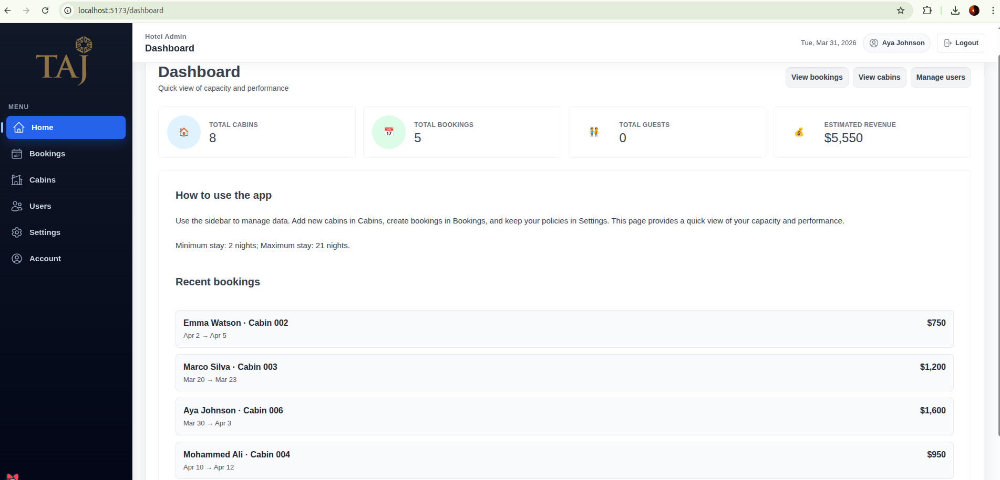
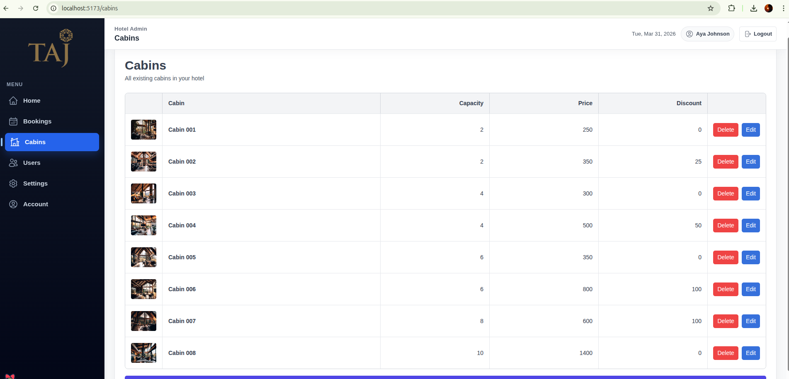
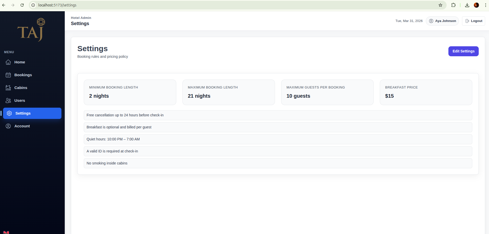

# Taj Hotel Dashboard (React + Vite)

Admin dashboard UI for managing cabins, bookings, users, and settings.

Built with React, React Router, React Query, and styled-components.

## Screenshots





## Quick start

```bash
npm i
npm run dev
```

## Demo login (no backend required)

This project includes a simple demo auth flow (localStorage) so the UI works without any backend.

- Open `/login`
- Use **Continue as admin** or any listed demo account

You can update your name/email/password from the **Account** page (demo-only).

## Bookings: adding new bookings

The Bookings page includes an **Add booking** form that saves new bookings to localStorage (so you can test the UI without Supabase).

## Supabase (optional)

The app can read cabins/bookings/settings from Supabase. If Supabase isn’t configured, it falls back to local mock data (and local bookings you create).

1. Copy `.env.example` → `.env`
2. Set:
   - `VITE_SUPABASE_URL`
   - `VITE_SUPABASE_ANON_KEY`

## Scripts

- `npm run dev` – start dev server
- `npm run build` – production build
- `npm run lint` – eslint
